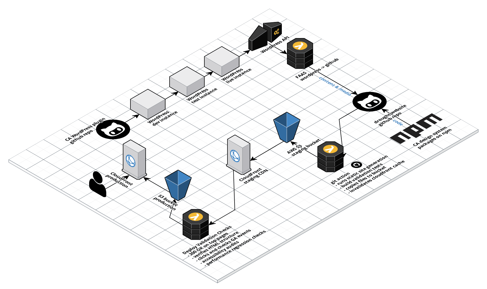

# drought.ca.gov

California State site for drought-related information.

## Site architecture

drought.ca.gov runs on top of several orchestrated services.
 
### Content workflow

Following the flow of content, from author to reader, provides a great tour of the site's infrastructure. 

* Site authors create and edit content within our Wordpress instance, hosted on [Pantheon](https://pantheon.io/).
* Whenever authors publish content, our [drought.ca.gov instance](https://github.com/cagov/services-wordpress-to-github-drought-ca-gov) of [wordpress-to-github](https://github.com/cagov/wordpress-to-github) fetches the content from Wordpress, then deposits it into this repository on GitHub. This service runs on [AWS Lambda](https://aws.amazon.com/lambda/).
* Any changes to the `main` branch of this repository, such as publishing content, will trigger a rebuild of the live site. This is handled via GitHub Action.
  * This GitHub Action will first execute our static site generator, [11ty](https://www.11ty.dev/). 11ty produces a folder, `docs`, with all the site's HTML.
  * Next, the GitHub Action uploads these site files to [AWS S3](https://aws.amazon.com/s3/).
  * Finally, the GitHub Action will invalidate the site's CDN cache in [AWS CloudFront](https://aws.amazon.com/cloudfront/). Cloudfront serves the files to readers from S3.
* Readers see updates on the live site.

### Network diagram

## Getting started

1. Clone this repo.
2. Run `npm install`.
3. Minimum recommended Node version: `14.17.3`, npm `7.6.3`.
4. To start developer mode, run `npm run dev`.
5. The site should become available on your local machine at `http://localhost:8080`.

### Important resources

Here's where various files live in this repo.

|Resource|Location|
|---|---|
|Templates|`src/templates`|
|Layouts|`src/templates/_includes/layouts`|
|Wordpress content|`src/templates/wordpress`|
|Wordpress media|`src/wordpress-media`|
|Custom components|`src/components`|
|CSS|`src/css`|
|Javascript|`src/js`|
|Images|`src/assets/img`|
|Site data|`src/templates/_data`|
|Site configuration|`odi-publishing`|
|GitHub Actions|`.github/workflows`|

Also take special note of the following files.

* `.eleventy.js`: The core configuration file for the static site generator, [11ty](https://www.11ty.dev/).
* `odi-publishing/wordpress-to-github.config.json`: The configuration file for [Drought's instance](https://github.com/cagov/services-wordpress-to-github-drought-ca-gov) of [wordpress-to-github](https://github.com/cagov/wordpress-to-github). 
* `src/templates/wordpress/wordpress.11tydata.js`: This file sets default values within [11ty's Data Cascade](https://www.11ty.dev/docs/data-cascade/) for every Wordpress article. It evaluates the JSON files for each corresponding piece of Wordpress content HTML.
* `src/py/generate-drought-map/readme.md`: This document explains the tech behind our weekly pull of the Drought Map. 